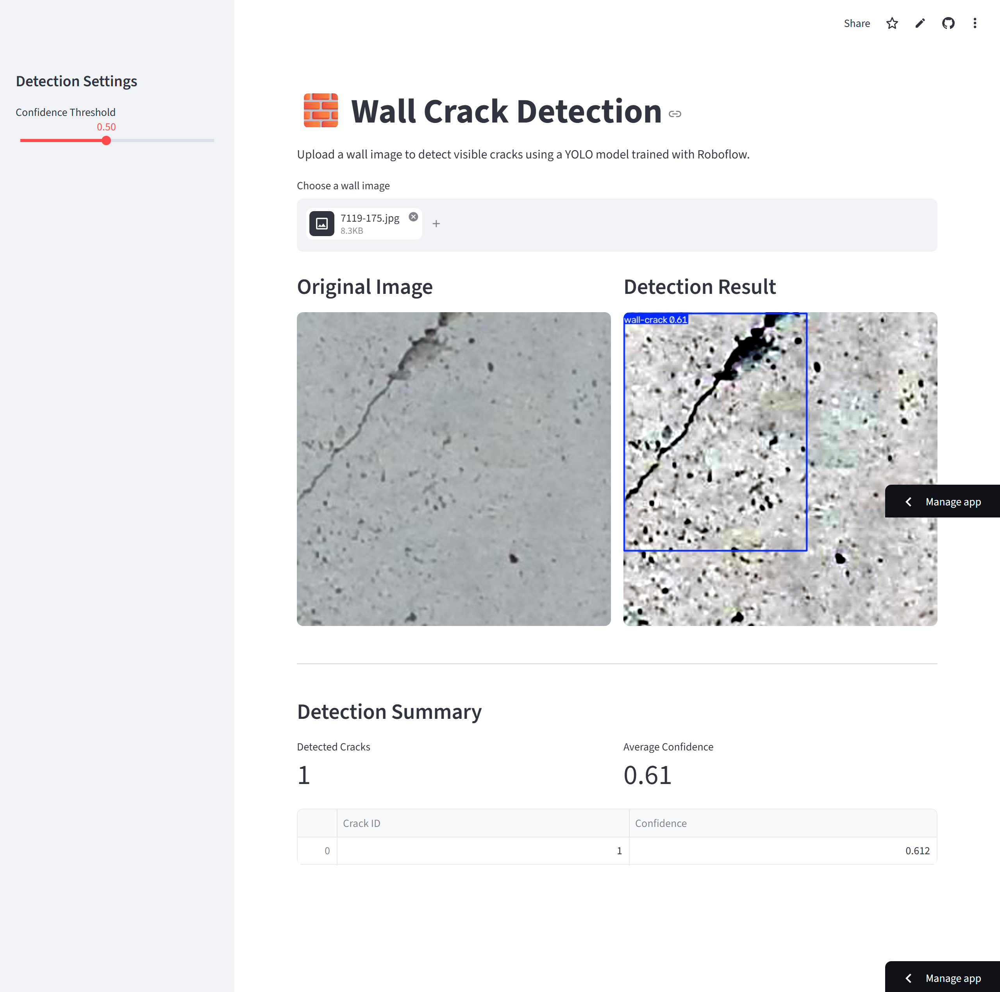

# 🧱 Wall Crack Detection using YOLOv11 and Streamlit

A web application for detecting wall cracks using a **YOLOv11 object detection model** trained with **Roboflow** and deployed on **Streamlit Community Cloud**.

The application allows users to upload an image of a wall and automatically detects visible cracks using a deep learning model.

---

## Demo

Upload a wall image and the application will:

- Detect wall cracks
- Display the annotated image
- Show the number of detected cracks
- Display the confidence score of each detection

---

## Features

- ✅ Wall crack detection using YOLOv11
- ✅ Streamlit web interface
- ✅ Confidence threshold adjustment
- ✅ Side-by-side comparison of original and detected images
- ✅ Detection summary
- ✅ Lightweight deployment on Streamlit Community Cloud

---

## Model

The detector was trained using **Roboflow**.

Dataset:
- Wall Crack Detection Dataset
- Object Detection
- Single class:
  - `wall-crack`

Training model:
- YOLOv11 Nano

---

## Roboflow Preprocessing

The dataset version was generated using:

- Auto-Orient
- Resize (Stretch to 640 × 640)
- Auto Contrast Stretching

The Streamlit application reproduces these preprocessing steps before inference to obtain predictions that closely match the Roboflow deployment.

---

## Project Structure

```
Wall-Crack-Detection/
│
├── app.py
├── best.pt
├── requirements.txt
├── README.md
│
├── images/
│
└── utils/
    └── detector.py
```

---

## Installation

Clone the repository

```bash
git clone https://github.com/<your_username>/<repository_name>.git
```

Move into the project

```bash
cd <repository_name>
```

Install the dependencies

```bash
pip install -r requirements.txt
```

Run the application

```bash
streamlit run app.py
```

---

## Deployment

This application is designed for deployment on **Streamlit Community Cloud**.

Deployment steps:

1. Push this repository to GitHub.
2. Log in to Streamlit Community Cloud.
3. Create a new app.
4. Select this repository.
5. Choose `app.py` as the entry point.
6. Deploy.

---

## Example

| Original Image | Detection Result |
|----------------|------------------|
| Upload image | Bounding boxes around detected wall cracks |

---

## Application Preview

### Main Interface and results



## Live Demo

[https://wall-crack-detection.streamlit.app/](https://wall-crack-detection.streamlit.app/)

## Technologies Used

- Python
- Streamlit
- Ultralytics YOLOv11
- Roboflow
- OpenCV
- Pillow
- NumPy
- Pandas

---

## Future Improvements

- Video crack detection
- Webcam support
- Download annotated images
- Detection statistics
- Crack severity estimation
- Crack length measurement
- Segmentation model support

---

## License

This project is released under the MIT License.

---

## Acknowledgements

- Roboflow
- Ultralytics YOLO
- Streamlit
